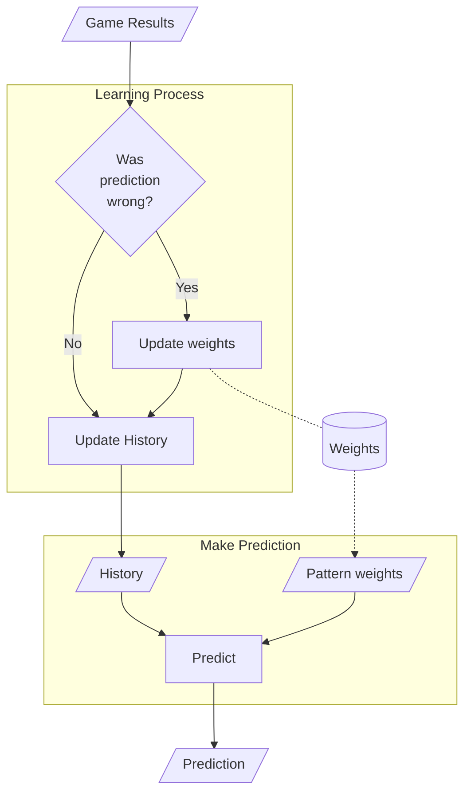
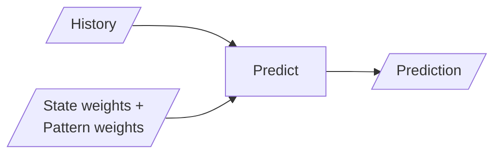
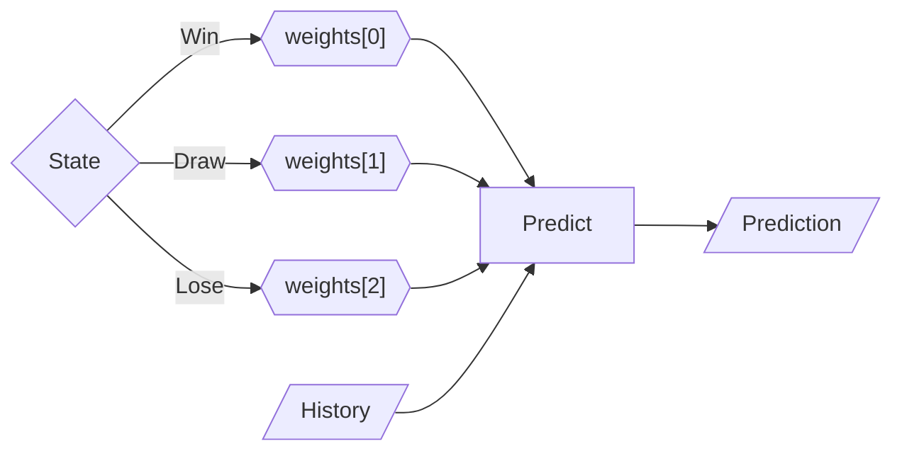
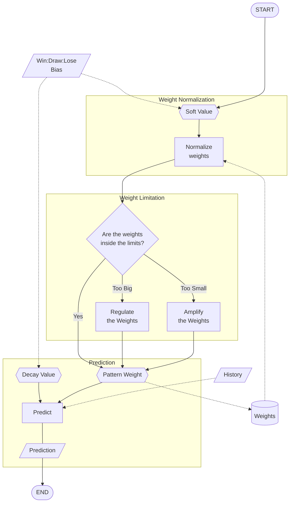
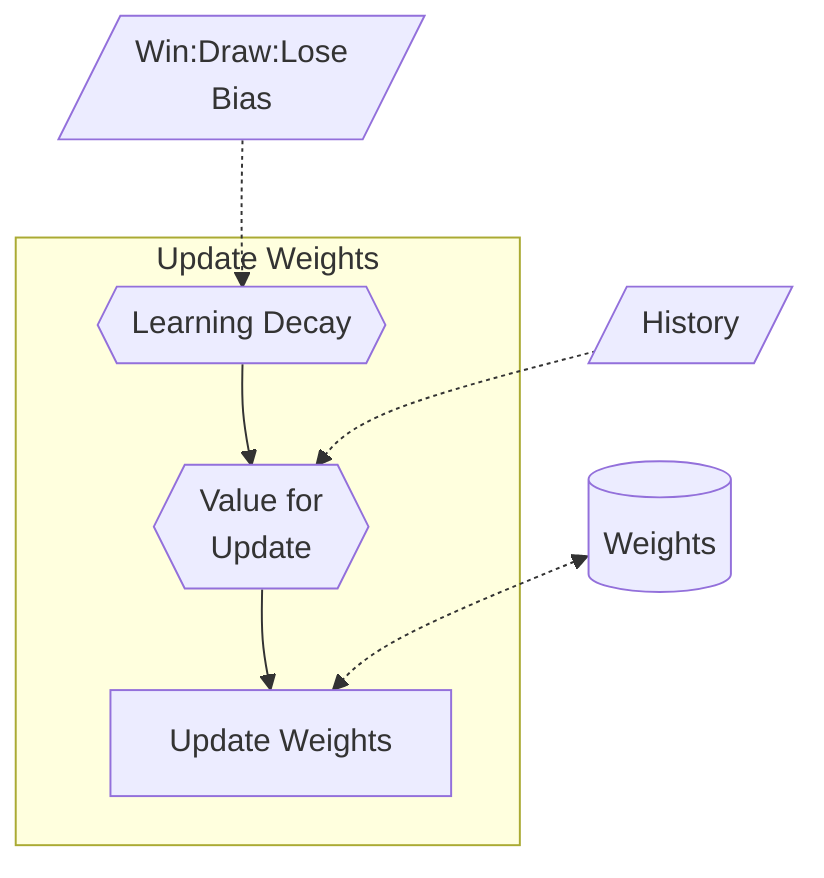
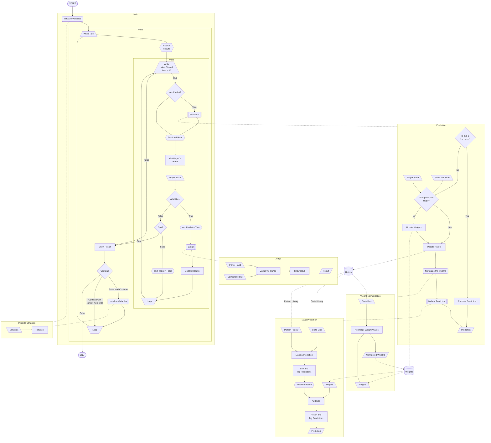

# RSP AI Project

Rock, Scissors, Paper game using an AI model with Python.

## Table of Contents

> - [**Overview**](#overview)
>   1. [Project Purpose](#project-purpose)
>   2. [How To Run](#how-to-run)
>   3. [What You Can Learn](#what-you-can-learn)
> - [**Summaries for Each Version**](#summaries-for-each-version)
> - [**About Each Version**](#about-each-version)
>   1. [-RSPGame](#-rspgame)
>   2. [-RSP_AIModel](#-rsp_aimodel)
>   3. [-RSP_AIModel_wResult_1D](#-rsp_aimodel_wresult_1d)
>   4. [-RSP_AIModel_wResult_2D](#-rsp_aimodel_wresult_2d)
>   5. [-RSP_AIModel_wResult_2D V1](#-rsp_aimodel_wresult_2dex-v1--)
>   6. [-RSP_AIModel_wResult_2D V2.0](#-rsp_aimodel_wresult_2dex-v20)
>   7. [-RSP_AIModel_wResult_2D V2.1](#-rsp_aimodel_wresult_2dex-v21)
> - [**Project Summary**](#project-summary)
>   1. [Summary Overview](#summary-overview)
>   2. [Challenges](#challenges)
>   3. [What Did I Learn from This Project?](#what-did-i-learn-from-this-project)
>   4. [Final Thoughts](#final-thoughts)
>   5. [What's next...?](#whats-next)
> - [**Whole System Flow Chart**](#whole-system-flow-chart)

## Overview

I created several AI models for the classic Rock, Scissors, Paper game.  
These models were based on the code I found online, original code written in C: [`https://s-shinomoto.com/janken/c.html`](https://s-shinomoto.com/janken/c.html).

### Project Purpose

The project serves two main purposes:

1. Experimention
2. Education

I built the models in raw Python code to understand the inner working of AI models.

### How To Run

To run the code:

1. Download the Python file the version you want to use.
2. Open a terminal and navigate to the directory where you downloaded the file.
3. Run the command: `python3 {PythonFileName.py}` (e.g., `python3 RSP_AIModel_wResult_2Dex_2_1_1.py`)

It's essentially just running a basic Python file.

### What You Can Learn

Here's what you can learn:

- The basic structure of AI, which is often hidden inside the "black boxes."
- Different types of AI models:
  - Static AI
  - Shallow AI
  - Adaptive AI (This project uses shallow AI)
  - Deep learning AI (a work in progress)
- How AI fairness works (and how to adjust the AI's difficulty).

[[Back to Top]](#table-of-contents)

## Summaries for Each Version

> ### RSPGame\*
>
>> A basic game with random guessing.  
>
> ### RSP\_AIModel\* (\*\_1D\*)
>
>> A shallow AI model, converted from the original C code.  
>> Using a single layer of weights.  
>
> ### \*\_wResult\_\*
>
>> Added state-based weights (win/draw/lose) to the history weights for improved predictions.
>
> ### \*\_2D\*
>
>> Introduced an extra layer of state patterns (win/draw/lose).
>

[[Back to Top]](#table-of-contents)

## About Each Version

### -RSPGame

This is the basic random guessing AI model.

- [RSPGame.py](https://github.com/Ryuji-Hazama/AI_RSP_Game/blob/main/RSPGame.py)
- Includes an ["unbeatable" version](https://github.com/Ryuji-Hazama/AI_RSP_Game/blob/main/RSPGame_unCompetitable.py) where the player can never win.
- There's also ["condensed" version](https://github.com/Ryuji-Hazama/AI_RSP_Game/blob/main/RSPGame_shorter.py), with the code made as concise as possible for educational purposes.

### -RSP_AIModel

This model was based on code I found online, which I then converted from C to Python.

- [RSP_AIModel.py](https://github.com/Ryuji-Hazama/AI_RSP_Game/blob/main/RSP_AIModel.py)
- I converted the code from C to Python by myself to understand the basic structure of the shallow learning AI.
- In [_1D version](https://github.com/Ryuji-Hazama/AI_RSP_Game/blob/main/RSP_AIModel_1D.py), I switched the weight list structure from 1D to 2D to make the AI's behavior easier to understand.

### -RSP_AIModel_wResult_1D

In this version, I added state-based weights (win/draw/lose) to the model, improving its predictions.

- [RSP_AIModel_wResult_1D.py](https://github.com/Ryuji-Hazama/AI_RSP_Game/blob/main/RSP_AIModel_wResult_1D.py)

### -RSP_AIModel_wResult_2D

This version adds a extra layer of state information, making the AI more aware of the last state.

- [RSP_AIModel_wResult_2D.py](https://github.com/Ryuji-Hazama/AI_RSP_Game/blob/main/RSP_AIModel_wResult_2D.py)
- That changed the pattern map structure from 1x3 to 3x3 (3 states(win/draw/lose) x 3 outputs (RSP)).
- It is increasing the learning cost.
- However, it is increasing the accuracy of predictions. Such as:
  - The player could throw the same hand every time he/she win.
  - The player could change the hand every time he/she lose.

### -RSP_AIModel_wResult_2Dex V1 -

Confidence decay, weight normalization and weight limitation were added from this version.

- [RSP_AIModel_wResult_2Dex V1](https://github.com/Ryuji-Hazama/AI_RSP_Game/blob/main/RSP_AIModel_wResult_2Dex_1_3_0.py)
- Confidence decay is:
  - Calculated from the recent win:draw:lose rate.
  - Using as a weight bias.
    - If the computer keeps winning, it increases confidence.
    - If the computer keeps losing, it decreases confidence and may change the prediction.
- Weight normalization is:
  - If the computer keeps winning, it increases the winning-pattern weights value and decreases the losing-pattern weights value.
  - If the computer keeps losing, it increases the losing-pattern weights value and decreases the winning-pattern weights value.
- Weight limitation is:
  - It limits overgrowth and overdecay (too close to zero) of the weights.
- Those changes make the AI more flexible and adaptable to players' strategy changes.

### -RSP_AIModel_wResult_2Dex V2.0

From this version, the weights are initializing with random values to make the model more human-like.

- [RSP_AIModel_wResult_2Dex V2.0](https://github.com/Ryuji-Hazama/AI_RSP_Game/blob/main/RSP_AIModel_wResult_2Dex_2_0_2.py)
- This gives the model more randomness at the beginning of the game.

### -RSP_AIModel_wResult_2Dex V2.1

This version added the learning decay calculated from win/draw/lose rate.

- [RSP_AIModel_wResult_2Dex V2.1](https://github.com/Ryuji-Hazama/AI_RSP_Game/blob/main/RSP_AIModel_wResult_2Dex_2_1_2.py)
- If the AI keeps winning and loses once, the AI thinks, "Is this just a random noise? Let it be ignored for now."
- And starts to keep losing, the AI thinks, "Oh, this is true. I need to change strategy now."

[[Back to Top]](#table-of-contents)

## Project Summary

### Summary Overview

Throughout this project, I've faced numerous challenges. But I've learned a lot by overcoming them.

I picked up some of those down below.

### Challenges

> V2.1 and before
>> [**Issue_1: *What is AI?***](#issue_1-what-is-ai)  
>> [**Issue_2: *Prediction accuracy***](#issue_2-prediction-accuracy)  
>> [**Issue_3: *Adaption***](#issue_3-adaption)
>
> V3.0
>> [**Issue_4: *Deep Learning***](#issue_4-deep-learning)
>

#### Issue_1: *What is AI?*

- **Issue: *I didn't know how to build an AI.***
  - I knew the basic concept of the AI structure, because I've learned it from some YouTube videos.
  - However, I didn't know how to turn that into code.

- **Approach: *Researched on the internet.***
  - I researched more about AI.
  - Search for the actual code.

- **Result: *Found a great example.***
  - I found a code written in C.
  - The code was written in raw code using only basic libraries.
  - That's why I thought that was a great example to understand the structure of the AI model.

[Challenges Top](#challenges)

#### Issue_2: *Prediction accuracy*

- **Issue: *How to make the predictions more accurate?***
  - The AI has been just tracking the player's hand patterns in the earlier model.
  - I need to reshape the AI structure to make the predictions more accurate.

- **Approach: *Add an extra layer to the model.***
  - I thought I needed to trace the most recent player's state. Because I thought:
    - If the player wins, the player might throw the same hand.
    - If the player loses, the player might change his/her hand.
    - Or perhaps, it might be completely opposite.
    - Which means human behaviour is highly related to the most recent result.
  - So, I added a layer of result state (win/draw/lose).
    - I changed pattern maps from simple 3 patterns (RSP patterns) to 3x3 patterns(3 states x 3 predictions), a total of 9 pattern maps.

- **Result: *Sometimes, the AI struggles.***
  - The prediction is getting accurate round by round.
  - The downside is that the learning cost has increased because of the extra pattern maps.
  - The upside is that the AI has become something like a master of the RSP game.
  - It makes the AI seem to struggle like a human.

[Challenges Top](#challenges)

#### Issue_3: *Adaption*

- **Issue: *How to adapt if the strategy changes?***
  - In the earlier version, weight patterns could overfit the earlier patterns.
  - The model was not flexible enough to accommodate the strategy changes.

- **Approach: *Using soft value.***
  - I used the state biases as a soft value.
    - Use soft values to reconsider the final results.
    - Use soft values to update (normalize) the current weight patterns.
  - Set weight limits (upper and lower) to regulate the weight values.

- **Result: *AI became flexible***
  - As a result, the model has become more flexible.
    - Quickly responds to the strategy changes.
    - Avoid overconfidence in the learning data in the early stage.
  - AI started to doubt the output and reconsider the predictions.

[Challenges Top](#challenges)

#### Issue_4: *Deep Learning*

- **Issue: *What is neural network?***
  - This is also something I knew the concept of, because I've learned it from some YouTube videos.
  - But I didn't know the actual code.
    - I didn't know how to put this concept into the code.
    - I couldn't find the code that I can see the network structure.
  - The biggest problem was, the learning process is almost completely different from the previous shallow AI.
    - I needed to figure out the learning process.

- **Approach: *Reverse Engineering***
  - I scaled the model down to be easy to understand and conduct experiments.
  - Before using the actual model, I made some charts and simulated it manually to understand the processes step by step.
  - I've thought of it in reverse that starting from the output and tracing the process toward the input.
    - From the output, which nodes activate the output?
    - And which input activates the specific nodes connected to the output?
    - To cause that output, what kind of state should the weights be in?

- **Result: *Working in progress...***
  - Working in progress...

[Challenges Top](#challenges)

### What Did I Learn from This Project?

- Basic structure and inner working of AI.
  - What is AI?
  - How does the AI work?
  - How does the machine learns? (In this case, the player's moves.)
  - How does the machine choose the answer? (In this case, how to choose a prediction.)
  - How does the AI adapt to different environments? (In this case, the strategy changes.)
  - *They are often hidden inside the **black boxes**.*
- Different types of AI models and how they fucntion.
  - Static AI model
  - Shallow AI
  - Adaptive AI (based shallow AI)
  - Deep learning AI (a work in progress)
- The importance of fairness in AI
  - How to adjust the difficulty level.
  - What if the AI becomes unbeatable?
- The "AI philosophy" (working in progress)
  - What if...
    - the AI doubts itself?
    - the AI confuses?
    - the AI struggles?
    - the AI has emotions?
  - What are humanity, thinking, and emotion as an AI?

### Final Thoughts

This project began as to teach beginners about code structure. In that process, I wondered how far today's AI could understand programming code. So first, I gave the AI (ChatGPT) the standard random guessing RSP game code, and then gave unbeatable code.  
And I've found the topic about the difficulty-tuning of AI in the answers from ChatGPT, and I started wondering what wold be like for AI to "think" or "feel". What if the AI starts thinking, doubting, and reconsidering its output?

So I started researching and studying AI models, created a structure from scratch (based on the code I found on the internet), and modified it to understand the AI, and also as an experiment.  
I failed many times and faced many challenges. But every time I've gotten over it, I've learned many new things. As a result, I'm not just successfully created an adaptive AI model, but I figured out how to make it more effective.

The funny thing is, I used AI (ChatGPT) to create another AI. The age of AI-generated AI might be closer than we thought. That is not a runaway sci-fi way, but a human-guided, collaborative way. And we are right in the middle of it now.

Through this project, I understood that understanding AI is understanding the future.

### What's next...?

I'm currently focused on creating a deep learning AI that can simulate even more advanced froms of decision-making.  
I'm also interested in exploring the difference between human and machine "thoughts," "feelings," and "emotions."

[[Back to Top]](#table-of-contents)

## Whole System Flow Chart

---

*What do you feel when you look at the **chart** and the **code** side by side?*

Is this too **chaotic** for a *simple* RSP game? Or is under 1,000 lines of code still too **simple** to reflect our *chaotic* human "thoughts"?

[[Back to Top]](#table-of-contents)
