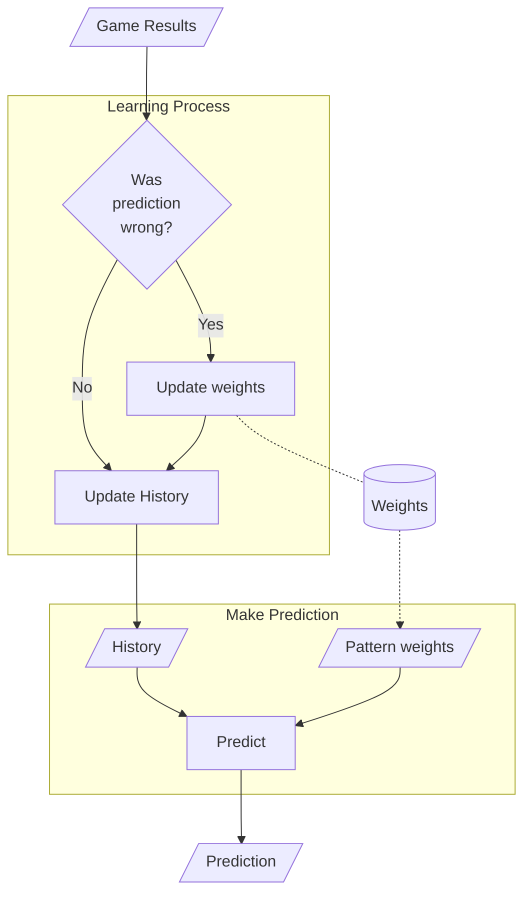
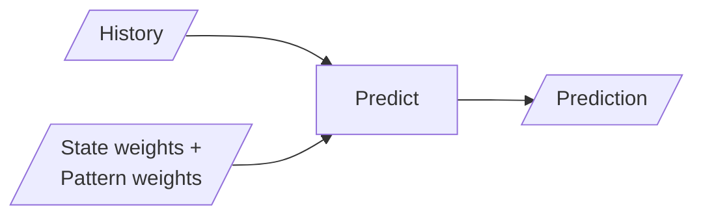
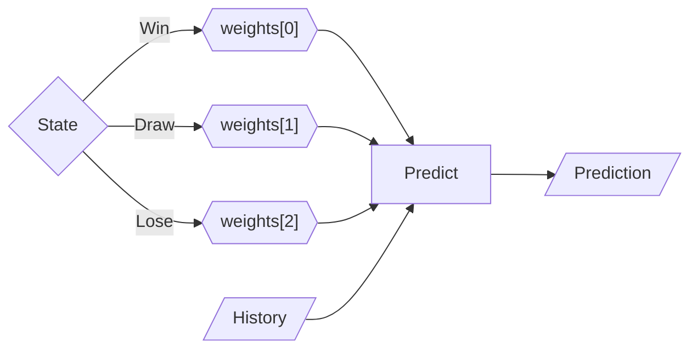
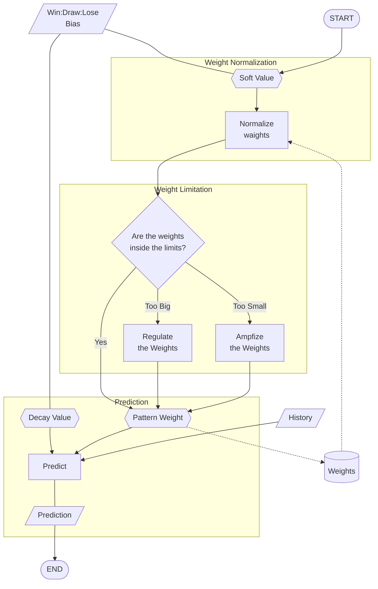
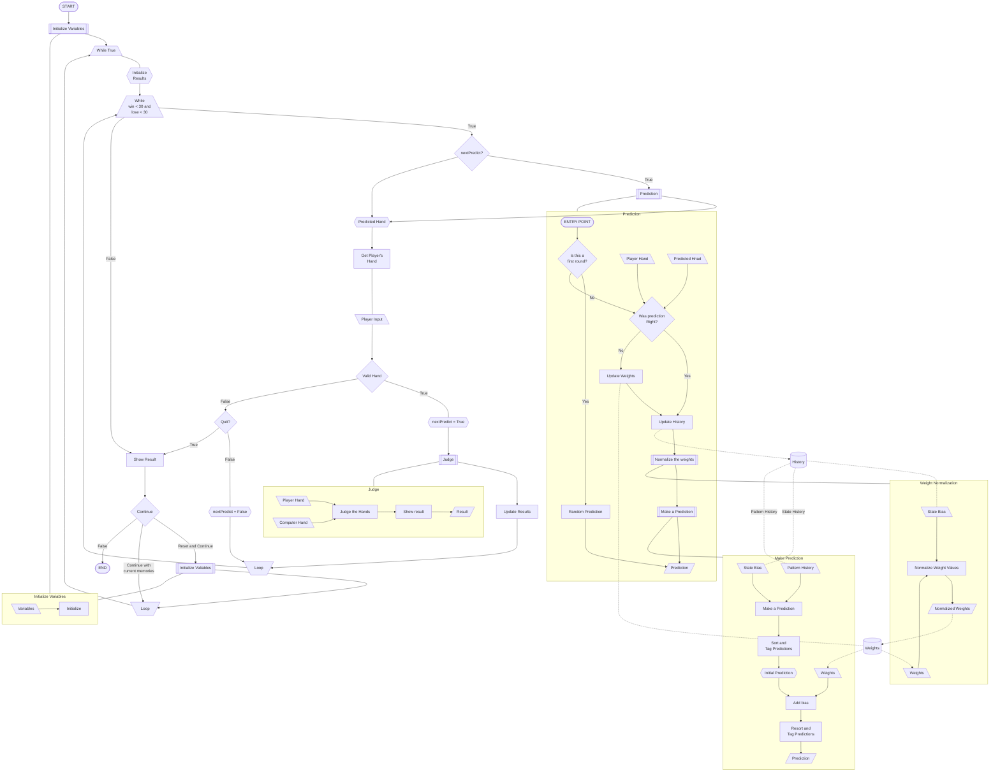

# RSP AI Project

Rock, Scissors, Paper game using an AI model with Python.

## Table of Contents

> - [**Overview**](#overview)
>   1. [Project Purpose](#project-purpose)
>   2. [How To Run](#how-to-run)
>   3. [What Could You Learn (and Have I Learned)](#what-could-you-learn-and-have-i-learned)
> - [**Summaries for Each Version**](#summaries-for-each-version)
> - [**About Each Version**](#about-each-version)
>   1. [-RSPGame](#-rspgame)
>   2. [-RSP_AIModel(_D1)](#-rsp_aimodel_1d)
>   3. [-RSP_AIModel_wResult_1D](#-rsp_aimodel_wresult_1d)
>   4. [-RSP_AIModel_wResult_2D](#-rsp_aimodel_wresult_2d)
>   5. [-RSP_AIModel_wResult_2D V1.0](#-rsp_aimodel_wresult_2dex-v10)
>   6. [-RSP_AIModel_wResult_2D V2.0](#-rsp_aimodel_wresult_2dex-v20)
>   7. [-RSP_AIModel_wResult_2D V2.1](#-rsp_aimodel_wresult_2dex-v21)
> - [**Project Summary**](#project-summary)
>   1. [Summary Overview](#summary-overview)
>   2. [Challenges](#challenges)
>   3. [What Did I Learn from This Project?](#what-did-i-learn-from-this-project)
>   4. [Final Thoughts](#final-thoughts)
>   5. [What's next...?](#whats-next)
> - [**Whole System Flow Chart**](#whole-system-flow-chart)

## Overview

I created some AI models for the classic Rock, Scissors, Paper game.  
I created those models based on the code that I found on the web (original code written in C: [`https://s-shinomoto.com/janken/c.html`](https://s-shinomoto.com/janken/c.html)).

### Project Purpose

The purposes are:

- Experiment
- Education

For those purposes, I created the models in raw Python code as much as I could to understand the structure of the AI model.

### How To Run

To run the code:

1. Download the Python file (with the version that you want).
2. Navigate to the downloaded directory using the terminal.
3. Run command: `python3 {PythonFileName.py}` (ex. `python3 RSP_AIModel_wResult_2Dex_2_1_1.py`)

Running the code is the same as any basic Python file.

### What Could You Learn (and Have I Learned)

- You can learn the basic structure of AI, which is usually hidden inside the black boxes.
- You can learn different kinds of AI models.
  - Static AI
  - Shallow AI
  - Adaptive AI (This time: based on shallow AI)
  - Deep learning AI (Progressing)
- You can learn the fairness of AI (tuning AI difficulty).

## Summaries for Each Version

> ### RSPGame\*
>
>> RSP game with random guessing.  
>
> ### RSP\_AIModel\* (\*\_1D\*)
>
>> An AI model that was converted from the original C code.  
>> Using only one layer of weights.  
>
> ### \*\_wResult\_\*
>
>> Adding weights based on the states (win/draw/lose) to the history weights.
>
> ### \*\_2D\*
>
>> Adding a layer of previous state (win/draw/lose).  
>

## About Each Version

### [-RSPGame](https://github.com/Ryuji-Hazama/AI_RSP_Game/blob/main/RSPGame.py)

- In this version, I created a basic random guessing AI model for the controlled version.
- I created an ["unbeatable" version](https://github.com/Ryuji-Hazama/AI_RSP_Game/blob/main/RSPGame_unCompetitable.py) that the player is never allowed to beat the computer.
- In the ["shorter" version](https://github.com/Ryuji-Hazama/AI_RSP_Game/blob/main/RSPGame_shorter.py), I made the code as short as possible I can for educational purposes.

### [-RSP_AIModel(_1D)](https://github.com/Ryuji-Hazama/AI_RSP_Game/blob/main/RSP_AIModel.py)

- In this version, I copied the model which I found on the web (original code was written in C: [`https://s-shinomoto.com/janken/c.html`](https://s-shinomoto.com/janken/c.html))
- I converted the code from C to Python by myself to understand the basic structure of the shallow learning AI.
- In [_1D version](https://github.com/Ryuji-Hazama/AI_RSP_Game/blob/main/RSP_AIModel_1D.py), I changed the weight list structure from a 1D matrix to a 2D matrix to easier to understand the structure.

### [-RSP_AIModel_wResult_1D](https://github.com/Ryuji-Hazama/AI_RSP_Game/blob/main/RSP_AIModel_wResult_1D.py)

- From this version, I added the state(win/draw/lose) weight into the current weight matrix to get more accurate predictions.
- This is one of the earlier models, so the weight structure is 1D matrix that is based on [RSP_AIModel](https://github.com/Ryuji-Hazama/AI_RSP_Game/blob/main/RSP_AIModel.py).

### [-RSP_AIModel_wResult_2D](https://github.com/Ryuji-Hazama/AI_RSP_Game/blob/main/RSP_AIModel_wResult_2D.py)

- From this version, I added the previous state layer before the pattern weight layer.
- That changed the pattern map structure from 1x3 to 3x3 (3 states(win/draw/lose) x 3 outputs (RSP)).
- It is increasing the learning cost.
- However, it is increasing the accuracy of predictions. Such as:
  - The player could throw the same hand every time he/she win.
  - The player could change the hand every time he/she lose.

### [-RSP_AIModel_wResult_2Dex V1.0](https://github.com/Ryuji-Hazama/AI_RSP_Game/blob/main/RSP_AIModel_wResult_2Dex_1_3_0.py)

- From version 1.0, I added a confidence decay. Which means:
  - Calculate the decay values based on the recent win:draw:lose rate.
  - Using that decay value as a weight bias.
  - If the computer keeps winning, it increases confidence.
  - If the computer keeps losing, it decreases confidence and may change the prediction.
- I added a weight normalization method. Which is to change the pattern map itself:
  - If the computer keeps winning, it increases the winning-pattern weights value and decreases the losing-pattern weights value.
  - If the computer keeps losing, it increases the losing-pattern weights value and decreases the winning-pattern weights value.
  - It makes the AI more flexible and adaptable to players' strategy changes.
- I added two weight limitations (upper limit and lower limit).
  - This limits overgrowth and overdecay (too close to zero) of the weights.

### [-RSP_AIModel_wResult_2Dex V2.0](https://github.com/Ryuji-Hazama/AI_RSP_Game/blob/main/RSP_AIModel_wResult_2Dex_2_0_1.py)

- From version 2.0, the weight is initialized with random values.
- This gives the model more randomness at the beginning of the game.
- Also, the AI becomes more human-like.

### [-RSP_AIModel_wResult_2Dex V2.1](https://github.com/Ryuji-Hazama/AI_RSP_Game/blob/main/RSP_AIModel_wResult_2Dex_2_1_0.py)

- From version 2.1, I added the learning decay based on win/draw/lose rate.
- This gives AI more humanity, like:
  - If the AI keeps winning and loses once, the AI thinks, "Is this just a random noise? Let it be ignored for now."
  - And starts to keep losing, the AI thinks, "Oh, this is true. I need to change strategy now."

## Project Summary

### Summary Overview

To proceed with this project, I've faced many problems and challenges. But at the same time, I've learned from those challenges.

I picked up some of those down below.

### Challenges

#### Issue_1: *What is AI?*

- **Issue: *I didn't know how to build an AI.***
  - I knew the basic concept of the AI structure, because I've learned it from some YouTube videos.
  - However, I didn't know how to turn that into code.

- **Approach: *Researched on the internet.***
  - I researched more about AI.
  - Search for the actual code.

- **Result: *Found a great example.***
  - I found a code written in C.
  - The code was written in raw code using only basic libraries.
  - That's why I thought that was a great example to understand the structure of the AI model.

#### Issue_2: *Prediction accuracy*

- **Issue: *How to make the predictions more accurate?***
  - The AI has been just tracking the player's hand patterns in the earlier model.
  - I need to reshape the AI structure to make the predictions more accurate.

- **Approach: *Add an extra layer to the model.***
  - I thought I needed to trace the most recent player's state. Because I thought:
    - If the player wins, the player might throw the same hand.
    - If the player loses, the player might change his/her hand.
    - Or perhaps, it might be completely opposite.
    - Which means human behaviour is highly related to the most recent result.
  - So, I added a layer of result state(win/draw/lose).
    - I changed pattern maps from simple 3 patterns (RSP patterns) to 3x3 patterns(3 states x 3 predictions), a total of 9 pattern maps.

- **Result: *Sometimes, the AI struggles.***
  - The prediction is getting accurate round by round.
  - The downside is that the learning cost has increased because of the extra pattern maps.
  - The upside is that the AI has become something like a master of the RSP game.
  - It makes the AI seem to struggle like a human.

#### Issue_3: *Adaption*

- **Issue: *How to adapt if the strategy changes?***
  - In the earlier version, weight patterns could overfit the earlier patterns.
  - The model was not flexible enough to accommodate the strategy changes.

- **Approach: *Using soft value.***
  - I used the state biases as a soft value.
    - Use soft values to reconsider the final results.
    - Use soft values to update (normalize) the current weight patterns.
  - Set weight limits (upper and lower) to regulate the weight values.

- **Result: *AI became flexible***
  - As a result, the model has become more flexible.
    - Quickly responds to the strategy changes.
    - Avoid overconfidence in the learning data in the early stage.
  - AI started to doubt the output and reconsider the predictions.

#### Issue_4: *Deep Learning*

- **Issue: *What is neural network?***
  - This is also something I knew the concept of, because I've learned it from some YouTube videos.
  - But I didn't know the actual code.
    - I didn't know how to put this concept into the code.
    - I couldn't find the code that I can see the network structure.
  - The biggest problem was, the learning process is almost completely different from the previous shallow AI.
    - I needed to figure out the learning process.

- **Approach: *Reverse Engineering***
  - I scaled the model down to be easy to understand and conduct experiments.
  - Before using the actual model, I made some charts and simulated it manually to understand the processes step by step.
  - I've thought of it in reverse that starting from the output and tracing the process toward the input.
    - From the output, which nodes activate the output?
    - And which input activates the specific nodes connected to the output?
    - To cause that output, what kind of state should the weights be in?

- **Result: *Processing...***
  - Processing...

### What Did I Learn from This Project?

- Basic structure of AI.
  - What is AI?
  - How does the AI work?
  - How does the machine learns? (In this case, the player's moves.)
  - How does the machine choose the answer? (In this case, how to choose a prediction.)
  - How does the AI adapt to different environments? (In this case, the strategy changes.)
  - *They are usually hidden inside the **black boxes**.*
- Different kinds of AI models.
  - Static AI model
  - Shallow AI
  - Adaptive AI (This time: based on shallow AI)
  - Deep learning AI (Progressing)
- The fairness of AI
  - How to tune the difficulty of the (AI in the) game?
  - What if the AI becomes unbeatable?
- The "AI philosophy" (still in progress)
  - What if...
    - the AI doubts themselves?
    - the AI confuses?
    - the AI struggles?
    - the AI has emotions?
  - What are humanity, thinking, and emotion as an AI?

### Final Thoughts

I've started this project to teach beginners the basic programming code structure. In that process, I wondered how far today's AI could understand programming code. So first, I gave the AI (ChatGPT) the standard random guessing RSP game code, and then gave unbeatable code.  
And I've found the topic about the difficulty-tuning of AI in the answers from ChatGPT, and I started wondering what the "thinking" is as an AI. I wonder what if the AI starts thinking, doubting, and reconsidering its output?

So I started researching and studying AI models, created a structure from scratch (based on the code I found on the internet), and modified it to understand the AI, and also as an experiment.  
I failed many times and faced many challenges. But every time I've gotten over it, I've learned many new things. As a result, I'm not just successfully created an adaptive AI model, but I figured out how to make it more effective.

The funny thing is, I used AI (ChatGPT) to create another AI. The age of AI-generated AI might be closer than we thought. That is not a runaway sci-fi way, but a human-guided, collaborative way. And we are right in the middle of it now.

Through this project, I understood that understanding AI is understanding the future.

### What's next...?

I'm wondering, what is the difference between humans' and machines' "thinking", "feeling", and "emotions"?  
So I'm continuing to study how to simulate those human things on an AI.

My priority task for now is creating deep-learning (neural network) AI.

## Whole System Flow Chart

---

*What do you feel when you see the **chart** and the **code** at the same time?*

Is this too **messy** for a *simple* RSP game? Or is less than 1,000 lines of code too **simple** to mimic *messy* human "thoughts"?
