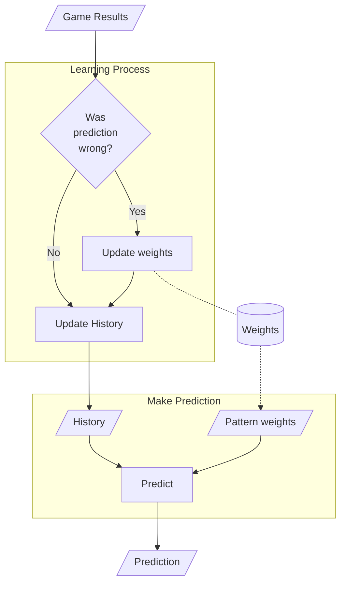
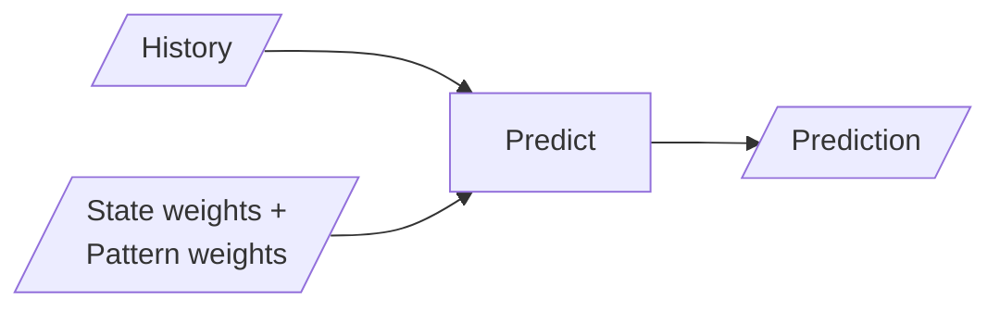
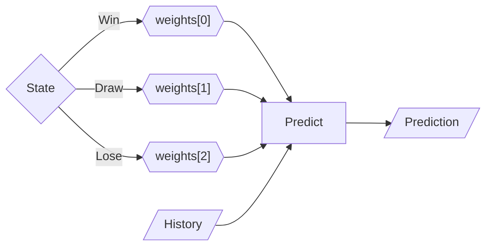
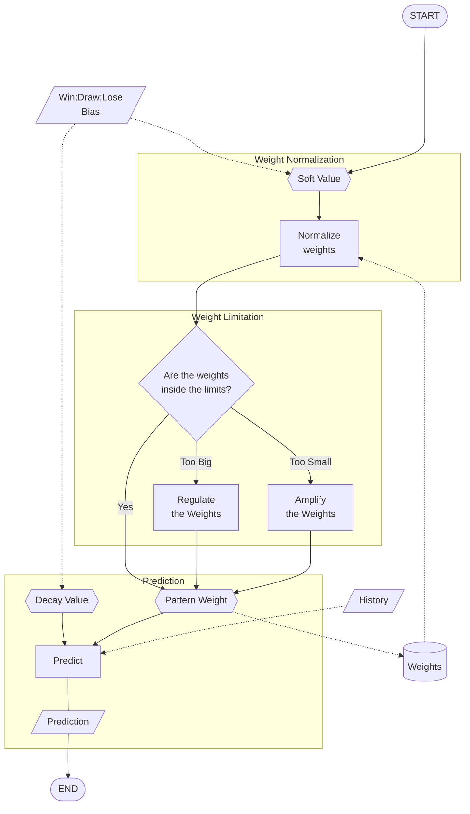
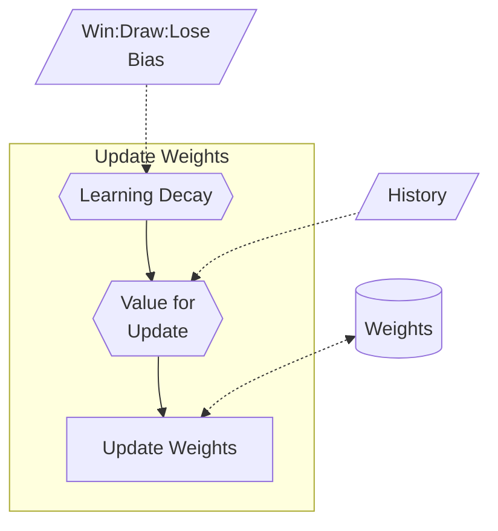
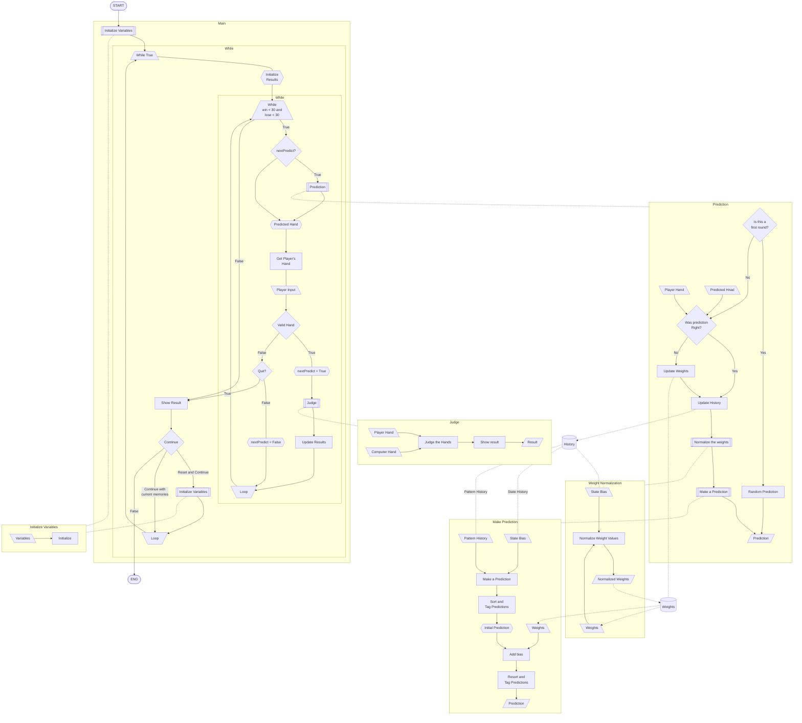

# Shallow Learning and Random Guessing AI

The simple shallow learning AI and Random Guessing AI model.

## Table of contents

## About Each Version

### -RSPGame

This is the basic random guessing AI model.

- [RSPGame.py](https://github.com/Ryuji-Hazama/AI_RSP_Game/blob/main/ShallowAndRandom/RSPGame.py)
- Includes an ["unbeatable" version](https://github.com/Ryuji-Hazama/AI_RSP_Game/blob/main/ShallowAndRandom/RSPGame_unCompetitable.py) where the player can never win.
- There's also ["condensed" version](https://github.com/Ryuji-Hazama/AI_RSP_Game/blob/main/ShallowAndRandom/RSPGame_shorter.py), with the code made as concise as possible for educational purposes.

### -RSP_AIModel

This model was based on code I found online, which I then converted from C to Python.

- [RSP_AIModel.py](https://github.com/Ryuji-Hazama/AI_RSP_Game/blob/main/ShallowAndRandom/RSP_AIModel.py)
- I converted the code from C to Python by myself to understand the basic structure of the shallow learning AI.
- In [_1D version](https://github.com/Ryuji-Hazama/AI_RSP_Game/blob/main/ShallowAndRandom/RSP_AIModel_1D.py), I switched the weight list structure from 1D to 2D to make the AI's behavior easier to understand.

### -RSP_AIModel_wResult_1D

In this version, I added state-based weights (win/draw/lose) to the model, improving its predictions.

- [RSP_AIModel_wResult_1D.py](https://github.com/Ryuji-Hazama/AI_RSP_Game/blob/main/ShallowAndRandom/RSP_AIModel_wResult_1D.py)

### -RSP_AIModel_wResult_2D

This version adds a extra layer of state information, making the AI more aware of the last state.

- [RSP_AIModel_wResult_2D.py](https://github.com/Ryuji-Hazama/AI_RSP_Game/blob/main/ShallowAndRandom/RSP_AIModel_wResult_2D.py)
- That changed the pattern map structure from 1x3 to 3x3 (3 states(win/draw/lose) x 3 outputs (RSP)).
- It is increasing the learning cost.
- However, it is increasing the accuracy of predictions. Such as:
  - The player could throw the same hand every time he/she win.
  - The player could change the hand every time he/she lose.

### -RSP_AIModel_wResult_2Dex V1 -

Confidence decay, weight normalization and weight limitation were added from this version.

- [RSP_AIModel_wResult_2Dex V1](https://github.com/Ryuji-Hazama/AI_RSP_Game/blob/main/ShallowAndRandom/RSP_AIModel_wResult_2Dex_1_3_0.py)
- Confidence decay is:
  - Calculated from the recent win:draw:lose rate.
  - Using as a weight bias.
    - If the computer keeps winning, it increases confidence.
    - If the computer keeps losing, it decreases confidence and may change the prediction.
- Weight normalization is:
  - If the computer keeps winning, it increases the winning-pattern weights value and decreases the losing-pattern weights value.
  - If the computer keeps losing, it increases the losing-pattern weights value and decreases the winning-pattern weights value.
- Weight limitation is:
  - It limits overgrowth and overdecay (too close to zero) of the weights.
- Those changes make the AI more flexible and adaptable to players' strategy changes.

### -RSP_AIModel_wResult_2Dex V2.0

From this version, the weights are initializing with random values to make the model more human-like.

- [RSP_AIModel_wResult_2Dex V2.0](https://github.com/Ryuji-Hazama/AI_RSP_Game/blob/main/ShallowAndRandom/RSP_AIModel_wResult_2Dex_2_0_2.py)
- This gives the model more randomness at the beginning of the game.

### -RSP_AIModel_wResult_2Dex V2.1

This version added the learning decay calculated from win/draw/lose rate.

- [RSP_AIModel_wResult_2Dex V2.1](https://github.com/Ryuji-Hazama/AI_RSP_Game/blob/main/ShallowAndRandom/RSP_AIModel_wResult_2Dex_2_1_2.py)
- If the AI keeps winning and loses once, the AI thinks, "Is this just a random noise? Let it be ignored for now."
- And starts to keep losing, the AI thinks, "Oh, this is true. I need to change strategy now."

[[Back to Top]](#table-of-contents)

## Whole System Flow Chart

---

*What do you feel when you look at the **chart** and the **code** side by side?*

Is this too **chaotic** for a *simple* RSP game? Or is under 1,000 lines of code still too **simple** to reflect our *chaotic* human "thoughts"?

[[Back to Top]](#table-of-contents)
